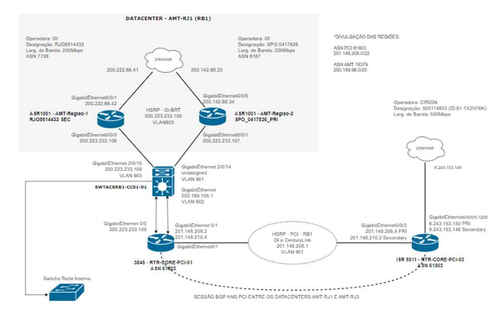

		

# Relatório de Avaliação de infraestrutura de TI

# 1.       Informações gerais

|                                                                         |     |
| ----------------------------------------------------------------------- | --- |
| AUDAZ TECNOLOGIA                                                        |     |
| Avenida Jaime Poggi, 99 – BL3 # 104 - Jacarepaguá - Rio de Janeiro - RJ |     |
| CEP: 22775-130                                                          |     |
| Tel.: (021) 3580-7301                                                   |     |

 
## 1.1     Responsáveis

|             |                                                                                                                                                                                             |
| ----------- | ------------------------------------------------------------------------------------------------------------------------------------------------------------------------------------------- |
| Consultores | Heron Brito  [heron@audaztecnologia.com.br](mailto:heron@audaztecnologia.com.br)     Rudá Angionela  [ruda@audaztecnologia.com.br](mailto:ruda@audaztecnologia.com.br) |

## 1.2     Dados do cliente

|   |   |   |
|---|---|---|
|Empresa|AGENCIA MODERNA TECNOLOGIA  Av. Rio Branco, 1 – 2009 centro, Rio de janeiro, RJ  CEP: 20090-003|   |
|Informações de Contato|Marcio Lacs  Diretor  Tel: 99564-3143  [mlacs@amt.com.br](mailto:mlacs@amt.com.br)  Wallace Mendes  Analista  Tel: (21) 2109-1950, 3849-3550  [wmendes@amt.com.br](mailto:wmendes@amt.com.br)|Marcello M. Pignataro  Coordenador  Tel.: (21) 2109-1950, 3849-4550  (21) 98106-9383  [mpignataro@amt.com.br](mailto:mpignataro@amt.com.br)|

## 1.3     Controle do documento

  
Localização do Documento

Este documento pode ser encontrado na rede corporativa da AUDAZ, contate o Gerente de Projetos para maiores informações.

Histórico

|          |                 |                   |             |
| -------- | --------------- | ----------------- | ----------- |
| Ver/Rev. | Data da revisão | Resumo da mudança | Autor       |
| rev01    | 01/03/2024      | Esqueleto inicial | Heron Brito |
| rev02    | 31/03/2024      | Versão inicial    | Heron Brito |
| rev03    | 08/04/2024      | Ajustes           | Heron Brito |
|          |                 |                   |             |

# 2.       Resumo executivo

## 2.1     Objetivo

Atualmente a empresa AMT faz uso de infraestrutura OnPremises hospedada em datacenters de terceiros. Paralelamente, o mercado de provedores de serviços em nuvem se consolidou e agora é também uma solução a ser considerada para futuros investimentos.

Com o intuito de auxiliar no processo de decisão dos próximos investimentos e projetos na área de TI, é de extrema importância avaliar o cenário atual de infraestrutura de TI que suporte as principais aplicações modernas que surgiram, como Microsserviços em Containers, Data Science e Machine Learning.

Além disso, será possível melhorar os acordos de níveis de serviços (SLA) oferecidos pela empresa e se adequar a padrões de alto nível exigidos atualmente.

Por esse motivo, os gestores e a equipe de TI da empresa AMT decidiram por contratar a empresa Audaz Tecnologia para realizar uma avaliação de sua infraestrutura atual de TI.

O objetivo desta avaliação se atém aos seguintes componentes:

·       Configurações de BGP dos ASN gerenciados pela AMT;

·       Arquitetura de rede;

·       Arquitetura de virtualização;

·       Aspectos básicos dos componentes de rede, storage e servidores;

Destaca-se que está fora de escopo desta atividade o que não se encontra na lista acima, bem como o que está fora do alcance desta análise.

# 3.       Infraestrutura

## 3.1     Infraestrutura de redes

### 3.1.1      Conectividade dos sistemas autônomos de Internet

#### 3.1.1.1     Ações Recomendadas

·       Entendemos que a infraestrutura atual é composta por dois Data Centers e dois sistemas autônomos, onde cada datacenter possui Peering individuas. E o ASN PCI é divulgado nos links da OI, já o inverso não é realizado.

·       Num cenário ideal, ambos os sistemas autônomos poderiam ser divulgados nos dois Data Centers e com redundância em si.

·       Com base num cenário de fortificação de uma infraestrutura principal e de simplificação operacional é recomendada a utilização de uma infraestrutura única, porém com redundância total em cada componente. Onde haverá dois switches CORE no Data Center e conexões redundantes para os roteadores e switches topo de rack.

  

### 3.1.2      Conectividade entre Data Centers

Problemas identificados:

·       Configurações de redes complexas e manuais dificultam a padronização e a operação.

·       Soluções de redundâncias em camada 2 são insuficientes para as características de resiliência exigidas para um Data Center. Como por exemplo, o uso de protocolos de Port-Channel, Spanning-tree, Q-in-Q, dentre outros.

O ideal para uma solução de roteamento camada 3 e camada 2, para o cenário atual, seria a adoção de tecnologias, como: VXLAN ou Cisco OTV.

#### 3.1.2.1     Ações necessárias

·       O cenário mais indicado é a utilização de apenas um Data Center com componentes totalmente redundantes.

·       E em casos específicos onde a arquitetura individual de um cliente exija um site de Disaster Recovery, recomenda-se a locação de infraestrutura em provedores de nuvens públicas.

### 3.1.3      Load Balancers

Não foram identificadas plataformas de balanceamentos de carga para aplicações. Este é um componente crucial para aplicações modernas.

### 3.1.4      DNS e certificados digitais

Apesar de não ter sido feita avalição de domínios e certificados digitais, destaca-se que é bastante relevante a correta operação desses componentes.  

## 3.2     Virtualização (Hypervisors)

Apesar de adotar uma abordagem interessante e uma estratégia inovadora para a comercialização de serviços de IAAS, que se alinham aos principais provedores de serviços de nuvem, é fundamental que os problemas relacionados ao uso do Apache CloudStack, identificados abaixo, sejam minuciosamente avaliados:

·       Utilização de múltiplos Hypervisors, incluindo Hyper-V, Apache Cloud Stack, OpenStack, KVM e Xen.

·       Foi possível observar que a adoção de plataformas de computação em nuvem do tipo de código aberto que foram utilizadas (Apache Cloud Stack e OpenStack), não foi implementada em sua plenitude.

·       A plataforma de código aberto Apache CloudStack apresenta deficiências de robustez, com numerosos bugs em aberto e um histórico significativo de problemas, conforme evidenciado pelo repositório GitHub do projeto e por uma apresentação da ShapeBlue.

·       Ausência de métricas avançadas de monitoramento de forma nativa.

·       Identificação de funcionalidades incompletas durante nossa análise, especialmente no que diz respeito ao roteador virtual, que carece de métricas de monitoramento, interface gráfica de usuário (GUI) e opções de customização.

·       A configuração da VPN site-to-site não oferece parametrizações detalhadas para atender a uma variedade de casos de uso.

·       Não foi encontrada integração nativa com armazenamento de objetos.

·       As funcionalidades do balanceamento de carga são insuficientes para suportar aplicações modernas atuais.

·       É um desafio manter atualizados todos os componentes destas plataformas distintas de virtualização.

·       Utilizando basicamente os componentes de virtualização de servidores. Entende-se que no Brasil existe uma escassez de mão de obra especializada para estas tecnologias.

·       Não conta com o respaldo oficial de um fabricante de software.

Não incluímos o OpenStack em nossa avaliação devido à sua implementação complexa, que o torna menos atrativo em comparação ao Apache CloudStack.

### 3.2.1      Ações necessárias

A implementação do Microsoft System Virtual Machine Manager (VMM) de forma unificada servirá como um passo crucial na direção de uma infraestrutura de virtualização mais robusta, integrada e de fácil gerenciamento. Esta sugestão não aborda todos os componentes de infraestrutura que os grandes provedores de nuvem pública oferecem, mas proporciona o básico de forma competente, servindo como alicerce para as aplicações dos clientes da AMT.

Outra abordagem seria investir em treinamento e capacitação da equipe na plataforma Apache CloudStack, buscando uma implementação abrangente e eficaz. Isso incluiria a criação de ambientes de laboratório e uma migração gradual, contando com o apoio de especialistas em plataformas Linux.  

## 3.3     Hardware – Ativos de Rede

Ações Necessárias:

·       Grande parte dos switches estão fora do prazo de garantia. Uma alternativa para uma contingência em caso de falha de alguns deles, seria garantir que ada servidor de virtualização possua conexão direta com pele menos dois equipamentos distintos e com configurações de protocolo LACP.

·       Os roteadores da AMT e das operadoras OI e Cirium aparentam estar no período de fim de vida, é recomendada a solicitação de renovação dos equipamentos por parte da operadora caso esta informação se concretize.

## 3.4     Hardware – Sistemas de armazenamento

Ações Necessárias:

·       O sistema de armazenamento DELL SC7020 está fora do prazo de garantia, este tipo de plataforma é recomendado, além de estar dentro da garantia, a contratação de suporte com SLA 24x7x4 .

## 3.5     Hardware – Servidores

Ações Necessárias:

·       servidores da linha R630 estão fora do período de garantia, caso existam aplicações com serviços de missão crítica, é recomendada a utilização de equipamentos com este tipo de suporte

## 3.6     Sistemas de armazenamento

Não foram fornecidos dados detalhados para a avaliação do sistema de armazenamento, incluindo:

·       Arquitetura de rede SAN

·       Distribuição macro dos dados por categoria (Aplicações de uso intenso de IO, Blocos para servidores, Backups, Object Storage, Bancos de dados e etc)

·       Interligação das controladoras

·       Distribuição lógica dos discos físicos

·       Software de gerenciamento

·       Políticas

·       Métricas de desempenho

## 3.7     Sistemas de armazenamento de objetos (Object Storage)

É essencial reconhecer a importância da avaliação do Object Storage para uma análise abrangente da infraestrutura voltada para aplicações modernas. Este componente desempenha um papel central na gestão eficaz de grandes volumes de dados, sendo crucial para aplicações que dependem intensivamente de tecnologias como Frontend JavaScript, Backups, repositórios de dados, bancos de dados No-SQL e outros recursos.

No entanto, esta avaliação não fez parte do escopo deste relatório.

## 3.8     Sistemas Operacionais Windows e Linux

Embora não tenhamos realizado uma análise direta dos sistemas operacionais Linux e Windows, entendemos que informações detalhadas sobre sua configuração, segurança, desempenho e atualizações seriam essenciais para uma avaliação completa da infraestrutura de TI. Portanto, recomendamos que seja incluídas em futuras avaliações.

## 3.9     Monitoramento e Observabilidade

É crucial reconhecer a importância dos componentes de Observabilidade (Métricas, Application Performance Monitoring (APM) e Logs) na infraestrutura de TI. Esses elementos desempenham um papel vital na monitorização e no diagnóstico de problemas. No entanto, este relatório não inclui uma avaliação detalhada desses componente.

## 3.10 Segurança

A análise de componentes de segurança não fez parte do escopo, tais como: Firewalls, IPS, XDR, SIEM, controle de identidade e auditoria.

## 3.11 Automação

Levando em consideração, o grande volume de servidores, cerca de 1300, é certo dizer a importancia da presença de muita automação na operação e no provisionamento de ambientes com infraestrutura para os clientes. Ferramentas de DevOps, em tarefas de atuazações de sistemas operacionais e aplicações, controle de acesso e rotina de backup, fazem parte da qualidade dos serviços prestados.

Contudo, a avaliação detalhada deste tipo de código de infraestrutura ficaram fora de escopo.