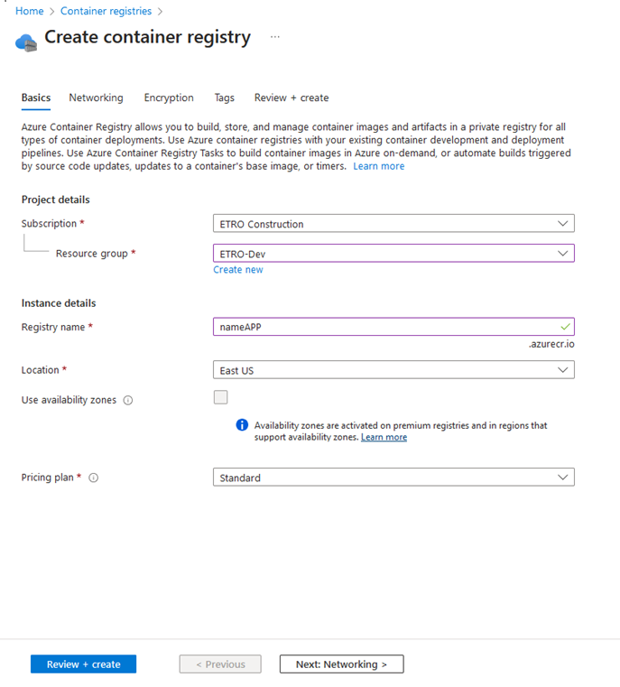
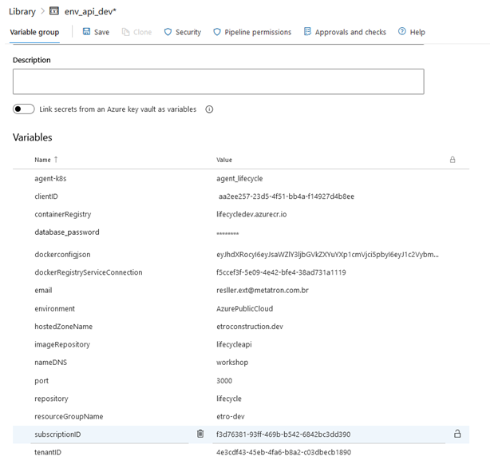

1. Criar um Container Registry no Azure


- Acessar o Portal do Azure:
	- Entre no portal do Azure (https://portal.azure.com).
- Navegar até Container Registries:
	- No menu lateral, clique em "Container registries" ou use a barra de pesquisa para encontrar.
- Criar um Novo Registro de Contêiner:
	- Clique em "+ Add" no topo da página para iniciar o processo de criação.
	- Preencha os campos obrigatórios:
		- Subscription: Selecione a assinatura do Azure onde o registro será criado.
		- Resource Group: Escolha um grupo de recursos existente ou crie um novo.
		- Registry Name: Dê um nome único ao seu registro de contêiner.
		- Location: Escolha a região onde o registro será criado.
		- SKU: Escolha entre Basic, Standard ou Premium, dependendo das suas necessidades.
	- Clique em "Review + Create" e depois em "Create" para concluir a criação.



Link da documentação Azure 
https://learn.microsoft.com/pt-br/azure/container-registry/container-registry-get-started-portal?tabs=azure-cli


2. Crie um Self-Hosted Agent no Azure DevOps

- Um Self-Hosted Agent é uma máquina que você configura para ser usada como agente de build e deploy no Azure DevOps, ao invés de utilizar os agentes hospedados pela Microsoft. Isso permite maior controle sobre o ambiente de execução.
- Preparar a Máquina para o Self-Hosted Agent
- Escolher o Sistema Operacional:
	- O Self-Hosted Agent pode ser configurado em Windows, Linux ou macOS. Certifique-se de que a máquina selecionada atende aos requisitos de sistema.
- Registrar o Self-Hosted Agent no Azure DevOps
- Acessar o Projeto no Azure DevOps:
	- No portal do Azure DevOps, navegue até o projeto onde deseja configurar o agente.
- Ir para as Configurações do Projeto:
	- No menu lateral, clique em "Project settings" (Configurações do Projeto).
- Acessar a Seção de Agentes:
	- Em Pipelines, clique em "Agent pools" (Pools de Agentes).
	- Selecione "Default" ou crie um novo Pool de Agentes se desejar separar os agentes.
- Adicionar um Novo Agente:
	- Clique em "New agent" para iniciar o processo de configuração.
	- Escolha o sistema operacional da máquina onde o agente será configurado.
-  Baixar e Configurar o Agente
  
- Baixar o Agente:
	- Siga as instruções na tela para baixar o pacote do agente apropriado para o sistema operacional escolhido.
- Configurar o Agente:
	- Extraia o pacote do agente em um diretório apropriado.
	- No terminal ou prompt de comando, navegue até o diretório do agente e execute o comando de configuração fornecido na tela do Azure DevOps, que incluirá o URL do servidor do Azure DevOps e o token de autenticação.
-            Verificar e Testar o Agente
- Verificar no Azure DevOps:
	- Após configurar e iniciar o agente, volte ao portal do Azure DevOps e verifique se o agente aparece no pool de agentes com o status "Online".

Link da documentação Azure 
https://learn.microsoft.com/en-us/azure/devops/pipelines/agents/agents?view=azure-devops&tabs=yaml%2Cbrowser#install


---
3. Criar uma Conexão de Serviço no Azure DevOps

- Acessar o Projeto no Azure DevOps:
	- Navegue até o projeto onde deseja configurar a conexão.
- Ir para Service Connections:
	- No menu lateral, selecione "Project settings" (Configurações do Projeto).
	- Em Pipelines, clique em "Service connections".
- Adicionar uma Nova Conexão de Serviço:
	- Clique em "+ New service connection".
	- Selecione "Docker Registry" e clique em "Next".
- Configurar a Conexão com o Container Registry:
	- No campo Docker Registry: insira o Login server do ACR (yourregistry.azurecr.io).
	- Em Docker ID e Docker Password: insira as credenciais de acesso ao ACR. Caso esteja usando um Service Principal, use o ID do Cliente e o Segredo do Cliente.
	- Em Service Connection Name: dê um nome amigável à conexão, como my-acr-connection.
	- Selecione a opção Grant access permission to all pipelines para facilitar o acesso ao registro em todos os pipelines do projeto.
	- Clique em Save para criar a conexão.

Link da documentação Azure 
https://learn.microsoft.com/en-us/azure/devops/pipelines/library/service-endpoints?view=azure-devops&tabs=yaml

---
4. Criar Pipeline de Build e Deploy

Criar o Arquivo YAML:
- Na raiz do repositório do seu projeto, crie um arquivo chamado azure-pipelines.yml.
- Abra o arquivo recém-criado e subsaitua o conteúdo existente (se houver) pelo pipeline YAML fornecido abaixo. Certifique-se de salvar as alterações.

```yaml
trigger:
- workshop-node
pool:
  name: Azure Pipelines
variables:
- group: env_api_dev
- name: dockerfilePath
  value: '$(Build.SourcesDirectory)/Dockerfile'
- name: tag
  value: '$(Build.BuildId)'
stages:
- stage: Build_And_Push
  jobs:
  - job: BuildAndPushJob
    pool: 'Azure Pipelines'
    steps:
    - checkout: self
    - task: Docker@2
      displayName: 'Login to Docker Registry'
      inputs:
        command: 'login'
        containerRegistry: $(dockerRegistryServiceConnection)
    - task: Docker@2
      displayName: Build and push an image to container registry
      inputs:
        command: buildAndPush
        repository: $(imageRepository)
        dockerfile: $(dockerfilePath)
        containerRegistry: $(dockerRegistryServiceConnection)
        tags: |
          $(tag)
  
  - job: DeployK8s
    dependsOn: BuildAndPushJob
    pool: $(agent-k8s)
    steps:
    - checkout: self
  
    - task: Bash@3
      displayName: Check k8s
      inputs:
        targetType: 'inline'
        script: | 
          kubectl --kubeconfig=/home/azureuser/.kube/config get no,po,svc,ing -A 
    - task: Bash@3
      displayName: 'Deploy k8s'
      env:
        DOCKER_IMAGE: '$(containerRegistry)/$(imageRepository):$(tag)'
        ENV: dev
        NAME: '$(repository)'
        PORT: $(port)
        EMAIL: $(email)
        CLIENTID: $(clientID)
        SUBSCRIPTIONID: $(subscriptionID)
        TENANTID: $(tenantID)
        RESOURCEGROUPNAME: $(resourceGroupName)
        HOSTEDZONENAME: $(hostedZoneName) 
        ENVIRONMENT: $(environment)
        NAMEDNS: $(nameDNS)
        SECRET-ACCESS-KEY: $(secret-access-key)
        DOCKERCONFIGJSON: $(dockerconfigjson)
        DATABASE_PASSWORD: $(database_password) 
      inputs:
        targetType: 'inline'
        script: |
          cat $(Build.SourcesDirectory)/k8s/deploy-k8s.yml | envsubst > k8s/deploy_temp.yaml
          cat k8s/deploy_temp.yaml
          kubectl --kubeconfig=/home/azureuser/.kube/config apply -f $(Build.SourcesDirectory)/k8s/deploy_temp.yaml
```


---
5. Crie um Grupo de Variáveis

- No Azure DevOps, vá para Pipelines > Library.
- Clique em + Variable group.
- Nomeie o grupo como env_api_dev e adicione as variáveis necessárias.


 

Link da documentação Azure 
https://learn.microsoft.com/en-us/azure/devops/pipelines/library/variable-groups?view=azure-devops&tabs=azure-pipelines-ui
---
6. Configure as Variáveis Necessárias para a Funcionalidade do Ambiente

- Adicione as seguintes variáveis ao grupo env_api_dev:
	- agent-k8s (nome do Self-Hosted Agent ) 
	- clientID (ID do cliente (client ID) da identidade atribuída pelo usuário no Azure. Esta identidade precisa ter permissões para manipular registros DNS na sua zona DNS) 
	- containerRegistry (Login server do Container registry no Azure  )
	- dockerconfigjson (Username e password do Container registry convertido em Base64  )
	- dockerRegistryServiceConnection (nome do serviço de conexão com o Container registry )
	- email (e-mail que será associado aos certificados emitidos pelo Let's Encrypt) 
	- environment ( define o ambiente do Azure que está sendo usado, que no caso é a nuvem pública do Azure )
	- hostedZoneName (é o nome da zona DNS no Azure que você está usando para seu domínio.)
	- imageRepository ( nome do Repositorio no Container registry )
	- nameDNS (nome do registro DNS)
	- port (porta em que a aplicação será executada)
	- repository (nome do repositório)
	- resourceGroupName ( nome do grupo de recursos no Azure onde os seus recursos ) 
	- subscriptionID (é o ID da assinatura do Azure onde seus recursos estão alocados )
	- tenantID (é um identificador único atribuído a cada locatário (ou inquilino) no Azure Active Directory (Azure AD). Ele é usado para identificar o locatário ao qual uma assinatura do Azure está associada.) 
-  Configure as Variáveis Necessárias do Projeto
  
- Certifique-se de que as variáveis do projeto estão configuradas corretamente no arquivo YAML.

---
7. Crie um Diretório na Raiz do Projeto Chamado k8s

- Na raiz do repositório do projeto, crie um diretório chamado k8s.
- Dentro do diretório k8s, crie um arquivo chamado deploy-k8s.yml.
- insira o conteúdo abaixo no arquivo deploy-k8s.yml.

```yaml
apiVersion: v1
kind: Namespace
metadata:
  name: $ENV
---
kind: Deployment
apiVersion: apps/v1
metadata:
  name: $NAME-backend-$ENV
  namespace: $ENV
spec:
  replicas: 1
  selector:
    matchLabels:
      deploy: $NAME-backend-$ENV
  strategy:
    type: Recreate
  template:
    metadata:
      labels:
        deploy: $NAME-backend-$ENV
        app.kubernetes.io/name: $NAME-backend-$ENV                          
    spec:
      imagePullSecrets:
        - name: docker-registry-secret
      containers:
        - name: $NAME-backend-$ENV
          image: $DOCKER_IMAGE
          ports:
            - containerPort: $PORT
          resources:
            requests:
              cpu: "10m"
              memory: "250Mi"
            limits:
              cpu: "1"
              memory: "600Mi"
          env:
            - name: DATABASE_PASSWORD
              value: $DATABASE_PASSWORD
      restartPolicy: Always
```
 
---
Definições de Secrets e Services.

```yaml
---
kind: Secret
type: kubernetes.io/dockerconfigjson
apiVersion: v1
metadata:
  name: docker-registry-secret
  namespace: $ENV
  labels:
    app: $NAME-backend-$ENV
data:
  .dockerconfigjson: $DOCKERCONFIGJSON
---
apiVersion: traefik.containo.us/v1alpha1
kind: Middleware
metadata:
  name: redirect
  namespace: $ENV
spec:
  redirectScheme:
    scheme: https
    permanent: true
---
apiVersion: v1
kind: Service
metadata:
  name: $NAME-$ENV-service
  namespace: $ENV
spec:
  selector:
    app.kubernetes.io/name: $NAME-backend-$ENV                           
  type: ClusterIP
  ports:
    - protocol: TCP
      name: porta$PORT
      port: $PORT
      targetPort: $PORT
```

---
Certificado Let's Encrypt.

```yaml
---
apiVersion: cert-manager.io/v1
kind: ClusterIssuer
metadata:
  name: letsencrypt-$ENV
  namespace: cert-manager
spec:
  acme:
    email: $EMAIL
    privateKeySecretRef:
      name: letsencrypt-$ENV
    server: https://acme-v02.api.letsencrypt.org/directory                      
    solvers:
    - dns01:
        azureDNS:
          clientID: $CLIENTID
          clientSecretSecretRef: 
            name: cert-manager-azure-secret-key-$ENV
            key: secret-access-key
          subscriptionID: $SUBSCRIPTIONID
          tenantID: $TENANTID
          resourceGroupName: $RESOURCEGROUPNAME
          hostedZoneName: $HOSTEDZONENAME
          environment: $ENVIRONMENT
```

---
Ingress Contoller.

```yaml
---
apiVersion: networking.k8s.io/v1
kind: Ingress
metadata:
  name: $NAME-$ENV-backend
  namespace: $ENV
  annotations:
    kubernetes.io/ingress.class: traefik
    cert-manager.io/cluster-issuer: letsencrypt-$ENV
    traefik.ingress.kubernetes.io/router.middlewares: $ENV-redirect@kubernetescrd
spec:
  ingressClassName: traefik
  rules:
  - host: $NAMEDNS-$NAME-backend.etroconstruction.dev
    http:
      paths:
        - pathType: Prefix
          path: /
          backend:
            service:
              name: $NAME-$ENV-service
              port:
                number: $PORT
  tls:
  - hosts:
    - $NAMEDNS-$NAME-backend.etroconstruction.dev
    secretName: ingress-$ENV-$NAME-backend-tls
```