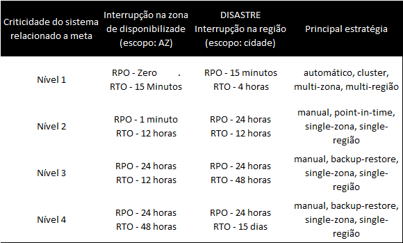
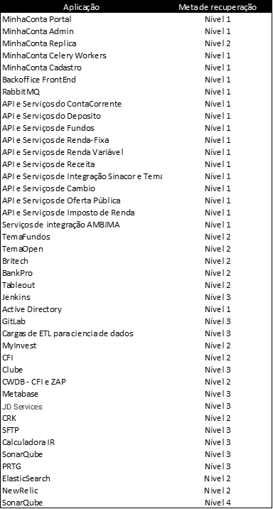
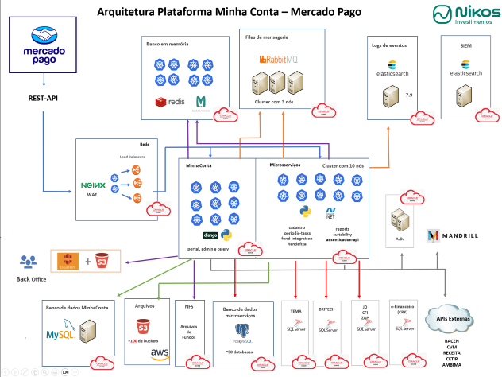
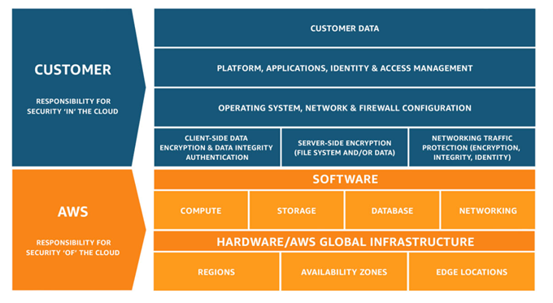
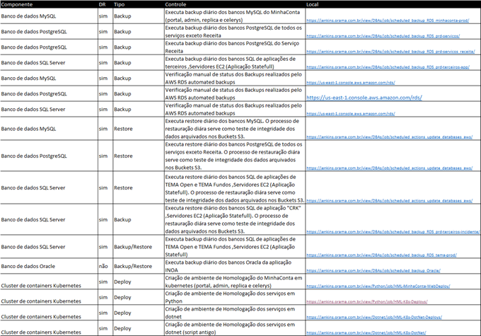
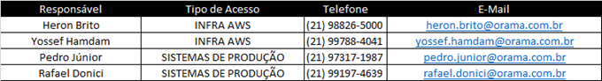

3.	Introdução

Um bom plano de recuperação pode garantir que o impacto sobre a produção da empresa seja mínimo. A empresa pode ser impactada por diversos tipos de eventos, desde danos à infraestrutura crítica a catástrofes naturais e qualquer evento que possa impactar negativamente as operações precisam ser inclusas no plano. A lista a seguir ilustra exemplo de eventos que pode gerar risco de interrupção nas operações de negócio:

*	Epidemias ou pandemias
*	Desastres naturais
*	Incêndios
*	Ciberataques
*	Dados corrompidos
*	Erros de configuração
*	Falhas em sistemas de telecomunicações
*	Falhas em sistemas de missão crítica
*	Além de outros

Este documento não contempla elaboração de cenários, processos de gestão de recursos humanos e o plano operacional das atividades de outros setores não relacionados a tecnologia da informação.
O foco do documento é em aplicações e componentes de infraestrutura em nuvem que compõem a plataforma MinhaConta. Nele será descrito os principais processos necessários a serem executados em caso de desastres na região de Nova Virginia, onde abriga a plataforma de serviços financeiros em nuvem da Nikos.

Um inventário atualizado de todos os componentes de infraestrutura e aplicações foram coletados para que a análise do plano fosse realizada.

---
4.	Metas de recuperação

As principais definições de metas são os indicadores RPO e RTO, em resumo eles tem os seguintes objetivos:

*	RPO -> Medir o ponto no tempo onde houve a falha e o último dado salvo.
*	RTO -> Medir o tempo total necessário para recuperação total do sistema.

As aplicações que utilizam dados históricos como, casos de ETL e Business Intelligence podem ser classificadas com níveis menos rígidos e com tempos de recuperação total (RTO) maiores.
Por outro lado, aplicações transacionais como: "MinhaConta Portal", "Serviço Conta Corrente" e "Serviços Renda Variável", precisam ser recuperados de forma mais rápida possível e sem perda de dados (RPO Zero).
Com este mesmo princípio, aplicações de notificações “push” e envio de e-mails pode ser classificadas como um nível intermediário.

As aplicações foram segmentadas de acordo com o objetivo do ponto de recuperação (RPO, na sigla em inglês) e o objetivo do tempo de recuperação (RTO, na sigla em inglês).

--- 
Uma vez definidas as metas de RPO e RTO é possível arquitetar com melhor eficiência o desenho de fluxo de dados, as tecnologias utilizadas e a escolha de cada recurso utilizado por cada componente da aplicação.
A tabela a seguir contém a lista de principais aplicações da Nikos e que estão contempladas neste plano:

--- 

Fora do escopo:

Alguns incidentes de TI que ocasionam a constatação de dados corrompidos ou inconsistentes. Estes tipos de eventos por ocorrer por conta dos fatores a seguir:

*	A hipótese da provedora de nuvem (AWS) incorrer de falhas operacionais não previstos em termos e SLAs, precisa ser levada em consideração.
*	Erros sistêmicos, sabotagem e outros eventos que permitam escrita de dados inconsistentes.

Estes incidentes devem ser tratados no âmbito de segurança e integridade de dados. E o processo de recuperação ocorre através de processos tradicionais de Backup/Restore e não é esta neste documento de meta de recuperação de desastre.

---

5.	Arquitetura do ambiente DR

O desenho a seguir ilustra uma visão geral da arquitetura escolhida a gestão dos serviços e operação das a principais aplicações ficam por conta da área de engenharia da Nikos e alguns dos componentes são utilizados da nuvem.

Atualmente, a AWS é utilizada como provedora de serviço de nuvem, e dela parte dos componentes são contratados como apenas infraestrutura e outros como serviços completos.
Para redundâncias entre regiões, a região de sa-east-1 (São Paulo) foi designada.

Cada componente da solução é ilustrado no desenho da arquitetura geral do DR.
 

Nota: Anexo a este documento existe o desenho com resolução superior.

---

Também sobre a arquitetura, é importante ressaltar que este modelo gera uma matriz de responsabilidades compartilhadas entre engenharia da Nikos e a provedora de nuvem, sendo assim ambas possuem uma atribuição para atingir as metas de recuperação de desastre.

  

---

6.	Componentes do ambiente

Pata tratar os processos necessários para correto funcionamento das aplicações em nuvem da Nikos e alcançar as metas de RPO e RTO, são necessários centenas de recursos de TI sejam eles de rede, armazenamento ou computacionais.
Para facilitar o gerenciamento e organização dos processos contidos neste documento, estes recursos foram agrupados em componentes. Nos tópicos a seguir serão descritas as seguintes características:

*	O papel do componente, seu objetivo o que ele faz;
*	Sobre redundância;
*	Estratégia de recuperação de dados;
*	Principais decisões arquitetônicas para zona e região;

6.1.	Rede

Os componentes de rede são formados pelos seguintes itens: Route53, CDN, Load Balancers, WAF, VPC, subredes, IGW, NAT Gateways, Transit Gateways, Direct Connect.

6.1.1	AWS Route53

Sobre o objetivo do componente:
Seu objetivo é converter os nomes DNS de toda a plataforma para endereços IP.

Sobre a estratégia ou tecnologia utilizada:
Utilização do AWS Route53 com alta disponibilidade global.

Principais decisões arquitetônicas para interrupção da zona:
Serviço com redundância global.

Principais decisões arquitetônicas para interrupção da região:
Serviço com redundância global.

6.1.2	CDN

Sobre o objetivo do componente:
Serviço rede de distribuição de conteúdo, ele recebe diretamente conexões do MinhaConta Portal

Sobre a estratégia ou tecnologia utilizada:
Será mantido um CloudFront secundário no ambiente DR, durante um desastre o DNS será reconfigurado para este. A utilizando de um segundo CloudFront também permite testes somente leitura no ambiente em separado.

Principais decisões arquitetônicas para interrupção da zona:
Serviço com redundância global.

Principais decisões arquitetônicas para interrupção da região:
Serviço com redundância global.

6.1.3	Load Balancers

Sobre o objetivo do componente:
Os Load Balancers recebem conexões de clientes orientadas as API de Serviço. Além do balanceamento de carga ele também permite a redundância, realizado roteamento apenas para workloads que estão respondendo.

Sobre a estratégia ou tecnologia utilizada:
São necessários dezenas de load balancers para correto funcionamento da plataforma, e foi escolhido Kubernetes para abrigar praticamente todas as aplicações do DR. Desta forma todo processo de criação e gerenciamento é automatizado pelo ingress do cluster

Principais decisões arquitetônicas para interrupção da zona:
O serviço é multi-zona por padrão e é gerenciado pela AWS.

Principais decisões arquitetônicas para interrupção da região:
Para cada API de produção um segundo load balance com as configurações será criado no DR, este processo será realizado através de deploy automático em Kubernetes

 
6.1.4	WAF

Sobre o objetivo do componente:
Responsável pela segurança de perímetro das conexões dos clientes. Ele atua integrado ao CloudFront e aos Load Balancers.

Sobre a estratégia ou tecnologia utilizada:
O serviço WAF para load balancer é multi-zona por padrão e é gerenciado pela AWS.

Principais decisões arquitetônicas para interrupção da zona:
O serviço WAF para load balancer é multi-zona por padrão e é gerenciado pela AWS.

Principais decisões arquitetônicas para interrupção da região:
Será criado um WAF na segunda região. O DNS é usado para fornecer um recurso de failover regional orquestrado, mas manual, uma vez que a infraestrutura na região 2 só seria disponibilizada no caso de uma constatação de um desastre.

6.1.5	VPC

Sobre o objetivo do componente:
Responsável pela abstração da Rede para os recursos na AWS.

Sobre a estratégia ou tecnologia utilizada:
Utilização de VPC exclusiva para o ambiente DR.

Principais decisões arquitetônicas para interrupção da zona:
O serviço é de redundância regional e gerenciado pela AWS.

Principais decisões arquitetônicas para interrupção da região:
Utilização de VPC exclusiva para o ambiente DR.

 
6.1.6	VPC subnets

Sobre o objetivo do componente:
Responsável por cada subredes IP na AWS

Sobre a estratégia ou tecnologia utilizada:
Utilização de subredes exclusivas para o ambiente DR.

Principais decisões arquitetônicas para interrupção da zona:
Existe uma por zona e os recursos são distribuídos a cada uma individualmente

Principais decisões arquitetônicas para interrupção da região:
Utilização de subredes exclusivas para o ambiente DR.

6.1.7	IGW e NAT Gateways

Sobre o objetivo do componente:
Responsável pelo roteamento de Internet nas subredes

Sobre a estratégia ou tecnologia utilizada:
Utilização de gateways exclusivos para o ambiente DR.

Principais decisões arquitetônicas para interrupção da zona:
O serviço é de redundância regional e gerenciado pela AWS.
Principais decisões arquitetônicas para interrupção da região:
Utilização de gateways exclusivos para o ambiente DR.

6.1.8	Direct Connect

Sobre o objetivo do componente:
Responsável pela interconectividade dos recursos na AWS e Data Centers On Premise da Nikos

Sobre a estratégia ou tecnologia utilizada:
Será configurado um segundo Direct Connect com o Data Center da Nikos

Principais decisões arquitetônicas para interrupção da zona:
O serviço é de redundância regional e gerenciado pela AWS.
Principais decisões arquitetônicas para interrupção da região:
Um segundo Direct Connect evitar problemas de configurações do atual, reduzindo este ponto único de falha.

6.2	Cluster de containers Kubernetes

Sobre o objetivo do componente:
Responsável por orquestrar aplicações em containers da Nikos com gerenciamento pelo time de engenharia.

Sobre a estratégia ou tecnologia utilizada:
Deploy automatizado de containers de Aplicações, APIs e Serviços.

Principais decisões arquitetônicas para interrupção da zona:
Possui recursos completos de clusters com auto escalonamentos horizontais e verticais.
Principais decisões arquitetônicas para interrupção da região:
Cluster exclusivo para o ambiente com deploy automatizado.

6.3	Cluster de containers AWS ECS

Sobre o objetivo do componente:
No escopo do ambiente DR abrigaram principalmente servidores dos clusters ECS e Kubernetes.

Sobre a estratégia ou tecnologia utilizada:
Estes serviços estão sendo migrados para Kubernetes, e seguirão o mesmo padrão de automação.

Principais decisões arquitetônicas para interrupção da zona:
Possui recursos completos de clusters com auto escalonamentos horizontais.
Principais decisões arquitetônicas para interrupção da região:
Migração dos serviços para Kubernetes

6.4	Servidores EC2 (Aplicação Stateless)

Sobre o objetivo do componente:
No escopo do ambiente DR abrigaram principalmente servidores dos clusters ECS e Kubernetes.

Sobre a estratégia ou tecnologia utilizada:
Servidores em servidores que se enquadram neste componente atendem o PORTAL e o ADMIN, estes terão deploys em Kubernetes no ambiente DR.

Principais decisões arquitetônicas para interrupção da zona:
Servidores que já possui auto scale e funcionam em cluster.
Principais decisões arquitetônicas para interrupção da região:
Migração dos serviços para Kubernetes
6.5	Servidores EC2 (Aplicação Statefull)

Sobre o objetivo do componente:
Servidores virtuais com aplicações em geral que possuem dependência de discos locais 

Sobre a estratégia ou tecnologia utilizada:
Replicação de volumes utilizando AWS Data Lifecycle Manager - Cross-Region copy

Principais decisões arquitetônicas para interrupção da zona:
Não possuem cluster.
Principais decisões arquitetônicas para interrupção da região:
Restauração Manual dos snapshots dos volumes em caso de desastre.

6.6	Cluster RabbitMQ

Sobre o objetivo do componente:
Serviço de mensageria que intermedia as comunicações entre as aplicações e serviços da plataforma.

Sobre a estratégia ou tecnologia utilizada:
Não será utilizada replicação de dados transientes no ambiente DR. Serão pré-instalados servidores.

Principais decisões arquitetônicas para interrupção da zona:
Cluster atualmente com 3 nós.
Principais decisões arquitetônicas para interrupção da região:
Instalação prévia de servidores

6.7	Filas AWS SQS

Sobre o objetivo do componente:
Serviço de mensageria utilizado pela API Cadastro

Sobre a estratégia ou tecnologia utilizada:
Não será utilizada replicação de dados transientes no ambiente DR.

Principais decisões arquitetônicas para interrupção da zona:
Serviço com alta disponibilidade gerenciado pela AWS.
Principais decisões arquitetônicas para interrupção da região:
Instalação prévia das filas

6.8	Banco de dados MySQL

Sobre o objetivo do componente:
Banco de dados responsável pela aplicação MinhaConta.

Sobre a estratégia ou tecnologia utilizada:
Utilização de RDS com Global DataStore e uma réplica de leitura no ambiente DR.

Principais decisões arquitetônicas para interrupção da zona:
Bancos em clusters com 3 nós
Principais decisões arquitetônicas para interrupção da região:

6.9	Banco de dados Postgre

Sobre o objetivo do componente:
Banco de dados responsável por aplicações, API e serviços.

Sobre a estratégia ou tecnologia utilizada:
Utilização de RDS com Global DataStore e uma réplica de leitura no ambiente DR.

Principais decisões arquitetônicas para interrupção da zona:
Bancos em clusters com pelo menos uma segunda instância de leitura.
Principais decisões arquitetônicas para interrupção da região:

6.10	Banco de dados SQL Server

Sobre o objetivo do componente:
Banco de dados responsável por aplicações de terceiros.

Sobre a estratégia ou tecnologia utilizada:
Utilização de RDS com Global DataStore e uma réplica de leitura no ambiente DR.

Principais decisões arquitetônicas para interrupção da zona:
Bancos em clusters com pelo menos uma segunda instância de leitura.
Principais decisões arquitetônicas para interrupção da região:

6.11	Banco de dados Redis
 
Sobre o objetivo do componente:
Bancos de dados em memórias utilizados pela plataforma.

Sobre a estratégia ou tecnologia utilizada:
Não será utilizada replicação de dados transientes no ambiente DR. Serão pré-instaladas somente as instâncias de bancos de dados vazias.

Principais decisões arquitetônicas para interrupção da zona:
Serviço com redundância global.

Principais decisões arquitetônicas para interrupção da região:
Serão pré-instaladas somente as instâncias de bancos de dados vazias.

6.12	Banco de dados Memcached

Sobre o objetivo do componente:
Bancos de dados em memórias utilizados pela plataforma.

Sobre a estratégia ou tecnologia utilizada:
Não será utilizada replicação de dados transientes no ambiente DR.

Principais decisões arquitetônicas para interrupção da zona:
Bancos em clusters com pelo menos uma segunda instância de leitura.
Principais decisões arquitetônicas para interrupção da região:
Serão pré-instaladas somente as instâncias de bancos de dados vazias

6.13	S3 Buckets

Sobre o objetivo do componente:
Responsável pelo armazenamento de arquivos estáticos por diversos serviços da plataforma.

Sobre a estratégia ou tecnologia utilizada:
Configuração de replicação através do AWS S3 Replication.

Principais decisões arquitetônicas para interrupção da zona:
O serviço é de redundância regional e gerenciado pela AWS.
Principais decisões arquitetônicas para interrupção da região:

---
7.	Planos detalhados de DR

Primeiramente o plano de DR precisar ter como objetivo alcançar as metas de recuperação, para tal é necessário que abranja as aplicações e os processos que elas sustentam de uma visão geral. Esta visão precisa combinar as tecnologias e arquitetura de cada componente da aplicação com a técnicas de backup e replicação de dados.

Cada plano precisa conter processo completo de recuperação e não apenas o backup, arquivamento ou replicação. Ele precisa conter as etapas desde o backup até a restauração, testes e limpeza.
Além disto os seguintes entregáveis de forma padronizadas são necessários:

*	Local para verificação de status dos processos rotineiros ou online de backup e(ou) replicação sendo o ideal Dashboards que possam ser utilizados pelo time de monitoramento, exemplo: Verificar status da réplica do AWS RDS através do script /data/check_rds_replica_status.sh
*	Passo a passo para execução com tarefas específicas, exemplo: executar o Job "Restore-RDS-001" no Jenkins
*	Tempo máximo para execução do passo a passo.
*	Caso o tipo componente permita, um processo de teste em ambiente somente leitura.

Nota:
Os planos detalhados de DR para cada complemento está em andamento.
Os seguintes componentes serão abordados: Rede, Cluster de containers Kubernetes, Cluster de containers AWS ECS, Servidores EC2 (Aplicação Stateless), Servidores EC2 (Aplicação Statefull), Cluster RabbitMQ, Filas AWS SQS, Banco de dados MySQL, Banco de dados PostgreSQL, Banco de dados SQL Server, S3 Buckets e de todas as aplicações comtempladas no plano.
O prazo estimado é de 12 meses.

8.	Criação de medida de controles:

8.1	Processo de controle de rotinas de backup e replicação

Para garantir o sucesso do plano em caso de uma eventualidade, é necessário a execução de controles diários.
A listagem a seguir são controles executados diariamente: 

 

 
8.2	Processo de validação de políticas de segurança

Os processos de auditoria de segurança são os mesmos executados no ambiente de produção.
Os acessos de usuários, grupos (IAM), Security Groups, seguem os mesmos requisitos do ambiente de produção.

8.3	Processo de revalidação e validação de novas aplicações

Para garantir a atualização desse plano, qualquer alteração em componentes de aplicação ou na arquitetura da aplicação precisam ser informadas.
No momento da criação de novas aplicações, os requisitos do ambiente DR devem fazer parte do seu desenvolvimento.
Atualmente, a fila de nome “AWS” da plataforma Jira é utilizada para gerenciar estas alterações.

8.4	Rotina de testes de aplicações somente leitura

Este processo visa a realização de testes no ambiente DR usando apenas base de dados em modo leitura. Estes tipos de teste devem ser realizados somente em aplicações que permitam este tipo de abordagem.

Nota: 
Assim como os planos detalhados de DR, estas rotinas também estão em desenvolvimento.

8.5	Processo de validação de políticas de segurança

Os processos de auditoria de segurança são os mesmos executados no ambiente de produção.
Os acessos de usuários, grupos (IAM), Security Groups, seguem os mesmos requisitos do ambiente de produção.

---
9.	Verificação anual de funcionamento do plano de desastre

9.1	Garantia de mais de uma forma de acesso aos consoles de gerenciamento 

Em alguns tipos de catástrofes ocorre a dificuldade de acesso do administrador aos consoles de gerenciamento. Outros riscos existem de perda de acesso pelo administrador pode ser a impossibilidade de acesso a seu segundo fator de autenticação (MFA), por exemplo um simples celular descarregado pode causar essa dificuldade. 
Sendo assim, são recomendadas pelo menos duas formas de acesso distintas e por pessoas diferentes. 
Atualmente, as pessoas responsáveis por este primeiro acesso são: 

 

De forma rotineira, os responsáveis precisam testar seus acessos, isto evita por exemplo, senha expirada durante uma crise. 

9.2	Execução de testes periódicos 

Por fim, a etapa mais importante do plano de DR, a simulação de desastre. Este processo possui as seguintes etapas:

*	Comunicação antecipada da janela de início e fim dos testes a todas as áreas da empresa e dos clientes;
*	Processos de desligamento do ambiente produtivo;
*	Execução de cada passo a passo do plano detalhado;
*	Testes de cada aplicação;
*	Coleta de evidências, logs, capturas de telas e outras;
*	Limpeza de bases de dados;
*	Processo de reativação do ambiente produtivo;
*	Realização de cadernos de testes das aplicações em produção.
