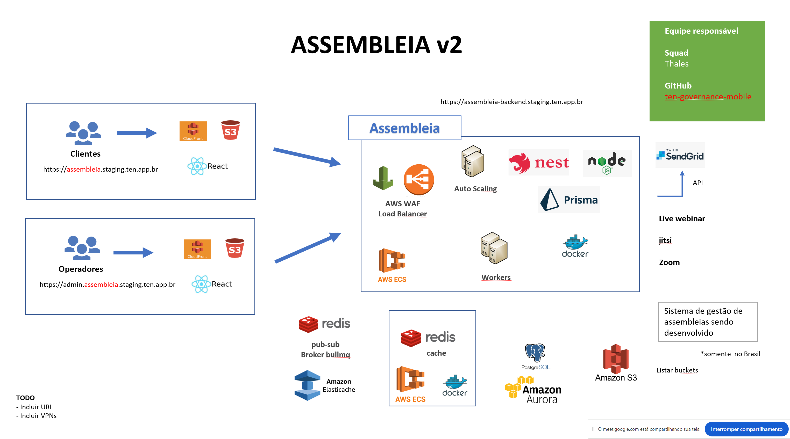

Documento técnico - As-built

1. Introdução

Este documento é um documento técnico as-built para a infraestrutura do aplicativo baseado em nuvem "Assembléia Digital". Este documento foi criado pela equipe de DevOps da AUDAZ TECNOLOGIA para o cliente TEN MEETINGS.

2. Visão geral da infraestrutura

A infraestrutura para o aplicativo "Assembléia Digital" é uma configuração de nuvem híbrida, utilizando Oracle Cloud e AWS. A infraestrutura consiste em vários componentes, incluindo servidores virtuais, balanceadores de carga, Oracle Container Engine for Kubernetes (OKE), PostgreSQL, cache Redis, sub-redes, Web Application Firewall (WAF), Oracle Object Storage, AWS S3, AWS Cloudfront, ElasticSearch para registro, ElasticSearch APM, Fluentd, Prometheus, Grafana e OpenVPN.

3. Servidores virtuais

Os servidores de aplicativos são hospedados no Oracle Cloud e AWS. Cada provedor de nuvem tem dois servidores virtuais, com dois servidores virtuais em cada domínio de disponibilidade para alta disponibilidade. Os servidores são configurados com a versão mais recente do Ubuntu e equipados com 4 vCPUs, 16 GB de RAM e 100 GB de armazenamento SSD.

4. Balanceadores de carga

O aplicativo utiliza balanceadores de carga do Oracle Cloud e do AWS. O balanceador de carga do Oracle Cloud é um balanceador de carga regional, enquanto o balanceador de carga do AWS é um balanceador de carga de aplicativo. Os balanceadores de carga são configurados para distribuir o tráfego uniformemente entre os servidores de aplicativos e fornecer alta disponibilidade e tolerância a falhas.

5. Oracle Container Engine for Kubernetes (OKE)

O aplicativo é conteinerizado usando o Docker e implantado no OKE. O OKE é um serviço Kubernetes gerenciado que fornece uma plataforma de orquestração de contêineres altamente disponível e escalável. O cluster OKE é configurado com três nós, cada um com 4 vCPUs, 16 GB de RAM e 100 GB de armazenamento SSD.

6. PostgreSQL

O aplicativo usa o PostgreSQL como o banco de dados principal. O banco de dados é hospedado no Oracle Cloud e configurado com duas instâncias, cada uma com 4 vCPUs, 16 GB de RAM e 100 GB de armazenamento SSD. As instâncias são configuradas para alta disponibilidade e são submetidas a backup diariamente.

7. Cache Redis

O aplicativo usa o Redis como uma camada de cache. O cache Redis é hospedado no Oracle Cloud e configurado com duas instâncias, cada uma com 4 vCPUs, 16 GB de RAM e 100 GB de armazenamento SSD. As instâncias são configuradas para alta disponibilidade e são submetidas a backup diariamente.

8. Sub-redes

A infraestrutura é dividida em várias sub-redes, cada uma com uma finalidade específica. As sub-redes são configuradas com grupos de segurança para controlar o tráfego de entrada e saída. As sub-redes também são configuradas com tabelas de rotas para rotear o tráfego para o destino apropriado.

9. Firewall de aplicativo da Web (WAF)

O aplicativo utiliza um WAF para proteger contra explorações comuns da Web. O WAF é configurado para bloquear ataques comuns, como injeção de SQL, script entre sites e sequestro de sessão. O WAF também é configurado para monitorar o tráfego e gerar alertas para atividades suspeitas.

10. Oracle Object Storage

O aplicativo usa o Oracle Object Storage para armazenar arquivos estáticos, como imagens e vídeos. O armazenamento é configurado com uma política de bucket para controlar o acesso aos objetos. Os objetos também são criptografados em repouso usando criptografia do lado do servidor.

11. AWS S3

O aplicativo usa o AWS S3 para armazenar logs e backups. O armazenamento é configurado com uma política de bucket para controlar o acesso aos objetos. Os objetos também são criptografados em repouso usando criptografia do lado do servidor.

12. AWS Cloudfront

O aplicativo utiliza o AWS Cloudfront para distribuir conteúdo globalmente. O Cloudfront é uma rede de entrega de conteúdo (CDN) que armazena conteúdo em cache em locais de borda, reduzindo a latência para usuários finais. O Cloudfront também é configurado para usar SSL para comunicação segura.

13. ElasticSearch para registro

O aplicativo usa o ElasticSearch para registro. O ElasticSearch é um mecanismo de pesquisa e análise RESTful distribuído, capaz de abordar um número crescente de casos de uso. Os logs são enviados ao ElasticSearch usando o Fluentd, uma ferramenta de coleta de dados.

14. ElasticSearch APM

O aplicativo usa o ElasticSearch APM para monitorar o desempenho do aplicativo. O APM é uma solução de monitoramento que coleta métricas, rastreamentos e logs do aplicativo. Os dados são enviados ao ElasticSearch usando o Fluentd.

15. Fluentd

O Fluentd é usado para coletar logs dos servidores de aplicativos e enviá-los ao ElasticSearch. O Fluentd é uma ferramenta de coleta de dados que oferece suporte a uma ampla variedade de fontes de dados e plug-ins de saída.

16. Prometheus

O Prometheus é usado para coletar métricas dos servidores de aplicativos e do cluster OKE. O Prometheus é um kit de ferramentas de monitoramento e alerta de código aberto que oferece suporte a uma ampla variedade de fontes de dados. Os dados são enviados ao Grafana para visualização.

17. Grafana

O Grafana é usado para visualizar as métricas coletadas pelo Prometheus. Grafana é uma solução de análise e monitoramento de código aberto que oferece suporte a uma ampla variedade de fontes de dados. O Grafana também é usado para visualizar os logs coletados pelo ElasticSearch.

18. OpenVPN

O OpenVPN é usado para fornecer re