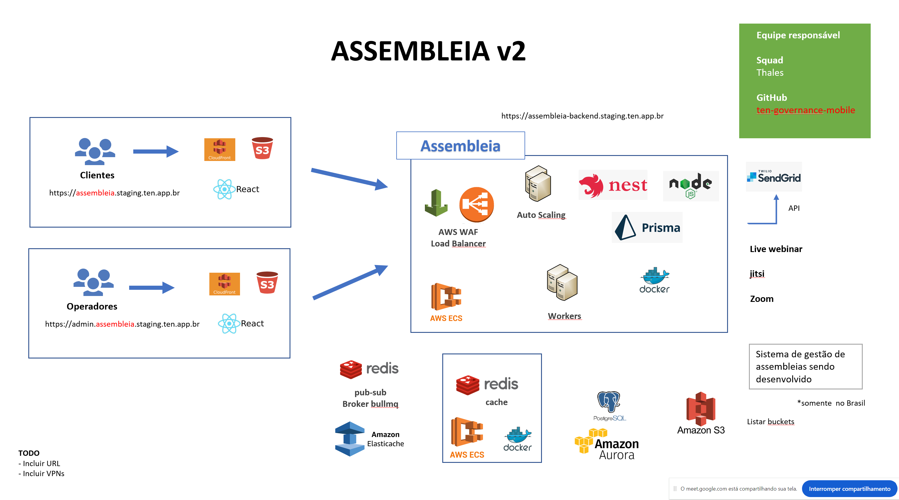

Este documento fornece uma visão geral da infraestrutura para o aplicativo 'Assembléia Digital', que é hospedado no Oracle Cloud e AWS. Os seguintes componentes são usados ​​na infraestrutura:

- Oracle Cloud: servidores virtuais Ubuntu com 2 vCPUs, 8 GB de RAM e 50 GB de armazenamento SSD, balanceadores de carga, OKE, Postgres, cache Redis, sub-redes, WAF, Oracle Object Storage, OpenVPN.
- AWS: S3, Cloudfront, ElasticSearch para registro, ElasticSearch APM, Fluentd, Prometheus e Grafana no Kubernetes.

As seções a seguir fornecem mais detalhes sobre cada componente.

1. Servidores virtuais

Todos os servidores utilizados na plataforma da Assembleia Digital são hospedados na Oracle Cloud. Nesse ambiente, são mantidos os nós do cluster Kubernetes, além de serviços essenciais como os bancos de dados Redis, Protheus, e as ferramentas de monitoramento e log, Grafana e Fluentd.

2. Balanceadores de carga

Os balanceadores de carga são usados ​​para distribuir o tráfego de entrada em vários servidores. Eles são implantados no Oracle Cloud e são responsáveis ​​por rotear o tráfego para o servidor apropriado com base em vários fatores, como capacidade do servidor, latência e disponibilidade.

3. OKE

OKE (Oracle Container Engine for Kubernetes) é um serviço Kubernetes gerenciado fornecido pelo Oracle Cloud. Ele é usado para implantar, gerenciar e dimensionar aplicativos em contêineres. O aplicativo 'Assembléia Digital' é implantado no OKE e é responsável por gerenciar o ciclo de vida dos contêineres do aplicativo.

4. Postgres

Postgres é um sistema de gerenciamento de banco de dados relacional usado para armazenar os dados do aplicativo 'Assembléia Digital'. Ele é implantado no Oracle Cloud e é responsável por gerenciar o esquema do banco de dados, a integridade dos dados e a otimização da consulta.

5. Cache Redis

Redis é um armazenamento de dados na memória usado como um cache para o aplicativo 'Assembléia Digital'. Ele é implantado no Kubernetes e é responsável por armazenar dados acessados ​​com frequência na memória para melhorar o desempenho do aplicativo.

6. Sub-redes

As sub-redes são usadas para dividir a rede em segmentos menores. Elas são implantadas no Oracle Cloud e são responsáveis ​​por rotear o tráfego entre diferentes partes da infraestrutura.

7. WAF

WAF (Web Application Firewall) é um serviço de segurança usado para proteger o aplicativo 'Assembléia Digital' de explorações comuns da web. Ele é implantado no Oracle Cloud e é responsável por monitorar o tráfego de entrada e bloquear solicitações maliciosas.

8. Oracle Object Storage

O Oracle Object Storage é um serviço de armazenamento em nuvem usado para armazenar os dados do aplicativo 'Assembléia Digital'. Ele é implantado no Oracle Cloud e é responsável por fornecer armazenamento seguro, escalável e durável para os dados do aplicativo.

9. AWS S3

O AWS S3 é um serviço de armazenamento em nuvem usado para armazenar os dados do aplicativo 'Assembléia Digital'. Ele é implantado no AWS e é responsável por fornecer armazenamento seguro, escalável e durável para os dados do aplicativo.

10. AWS Cloudfront

AWS Cloudfront é um serviço de rede de entrega de conteúdo (CDN) usado para melhorar o desempenho do aplicativo 'Assembléia Digital'. Ele é implantado na AWS e é responsável por armazenar em cache e entregar conteúdo estático aos usuários com baixa latência e alto rendimento.

11. ElasticSearch para registro

ElasticSearch é um mecanismo de pesquisa e análise distribuído usado para registrar o aplicativo 'Assembléia Digital'. Ele é implantado na AWS e é responsável por armazenar e indexar os logs do aplicativo para facilitar a pesquisa e a análise.

12. ElasticSearch APM

ElasticSearch APM é um serviço de monitoramento e observabilidade usado para o aplicativo 'Assembléia Digital'. Ele é implantado no Kubernetes e é responsável por coletar e analisar métricas de desempenho para o aplicativo.

13. Fluentd

Fluentd é uma ferramenta de coleta e encaminhamento de dados usada para o aplicativo 'Assembléia Digital'. Ele é implantado no Kubernetes e é responsável por coletar e encaminhar logs dos contêineres do aplicativo para o ElasticSearch.

14. Prometheus

O Prometheus é uma ferramenta de monitoramento e alerta usada para o aplicativo 'Assembléia Digital'. Ele é implantado no Kubernetes e é responsável por coletar e armazenar métricas de desempenho para o aplicativo.

15. Grafana

O Grafana é uma ferramenta de visualização e análise de dados usada para o aplicativo 'Assembléia Digital'. Ele é implantado no Kubernetes e é responsável por visualizar as métricas de desempenho coletadas pelo Prometheus.

16. OpenVPN

O OpenVPN é um serviço de rede privada virtual (VPN) usado para o aplicativo 'Assembléia Digital'. Ele é implantado no Oracle Cloud e é responsável por fornecer comunicação segura e criptografada entre o aplicativo e seus usuários.

A infraestrutura é projetada para ser altamente disponível, escalável e segura. Ela é monitorada e mantida pela equipe de DevOps da AUDAZ TECNOLOGIA para garantir desempenho e tempo de atividade ideais para o aplicativo 'Assembléia Digital'.