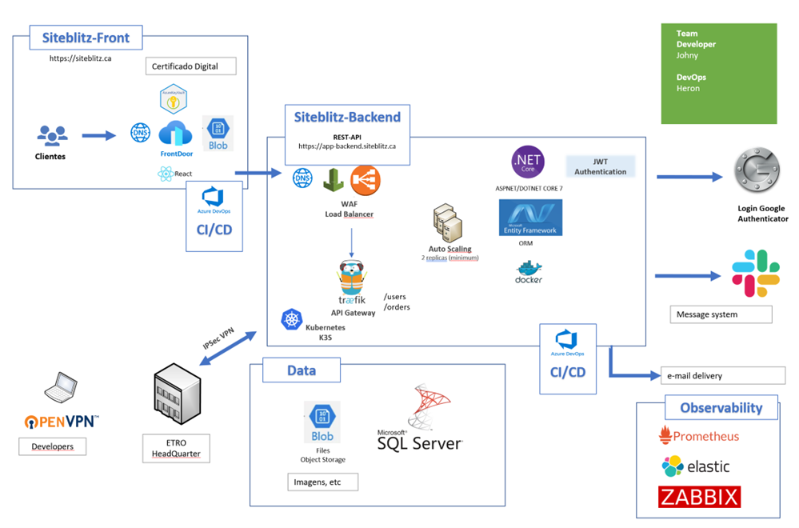

3	Arquitetura
3.1	Visão geral

A aplicação web Siteblitz é um sistema de engenharia projetado para gerenciar materiais e ferramentas em obras. A infraestrutura na Azure foi cuidadosamente planejada e implementada para garantir escalabilidade, disponibilidade e segurança.

3.1	Arquitetura da Aplicação

 

A aplicação Siteblitz composta por três camadas principais:

-	Camada de FrontEnd: Desenvolvida usando o framework JavaScript, React, esta camada fornece a interface de usuário da aplicação.
-	Camada de BackEnd: Implementada como uma API REST utilizando o framework Dotnet em Docker. Esta camada lida com a lógica de negócios da aplicação. 
-	Camada de Dados: Utiliza o SQL Server como banco de dados para armazenar informações sobre materiais e Object Storage para armazenar arquivos.

3.2	Arquitetura da Infraestrutura

3.2.1	Frontend

ESCREVER.

A Azure FrontDoor é utilizada como serviço de roteamento global e balanceamento de carga para a camada de apresentação. Ele fornece escalabilidade automática, alta disponibilidade e proteção contra ataques DDoS. Blob Storage armazena os arquivos estáticos da aplicação, como imagens, vídeos e scripts.

3.2.2	Backend

A Azure Load Balancer distribui o tráfego entre as instâncias do serviço da camada lógica para garantir alta disponibilidade e desempenho. Já a, Azure Gateway fornece conectividade segura entre a infraestrutura na Azure e redes locais ou outras nuvens. 

O componente Traefik é utilizado como um proxy reverso e controlador de tráfego para aplicativos em contêineres Docker. E tambem, Docker e Kubernetes são utilizados para implantar e orquestrar contêineres na nuvem. Isso proporciona escalabilidade automática, fácil gerenciamento e isolamento de aplicativos.

3.2.3	Containers

ESCREVER.

3.2.4	Dados

ESCREVER.
SQL SERVER
S3-Like

3.2.5	Rede

Azure CDN (Content Delivery Network) é utilizado para distribuir conteúdo estático da aplicação para usuários finais com baixa latência e alta disponibilidade. Além disso, Azure DNS gerencia o sistema de nomes de domínio para roteamento eficiente de solicitações de usuário.
VPN.
OPENVPN.

3.2.6	Segurança

 O JWT (JSON Web Token) é usado para autenticação entre as camadas da aplicação, garantindo que apenas usuários autorizados acessem recursos específicos. O API de Integração com Google Login Authenticator oferece uma camada adicional de autenticação segura, permitindo que usuários façam login usando credenciais do Google.

3.2.7	Monitoramento e Observabilidade

 A Elasticsearch e Kibana são usados para armazenar, pesquisar e visualizar logs da aplicação e infraestrutura, permitindo a análise de dados e identificação de problemas. Já o Prometheus e Grafana são utilizados para monitorar métricas de desempenho da aplicação, como uso de CPU, memória e tráfego de rede. 
O Zabbix é implementado para monitoramento proativo da infraestrutura, alertando sobre falhas e anomalias.

