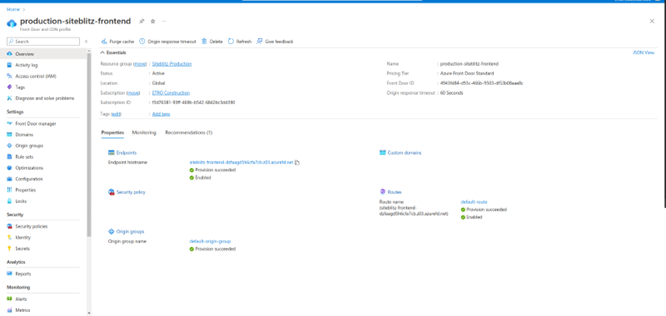
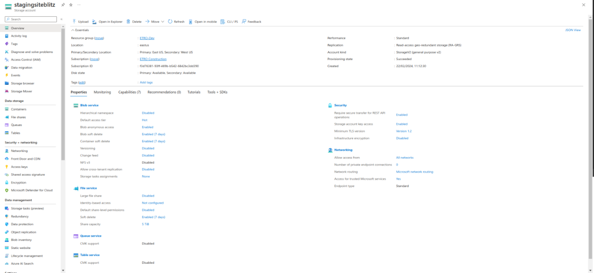
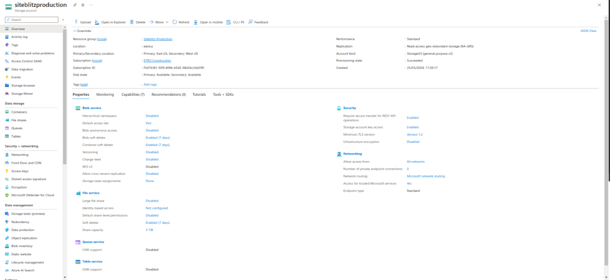
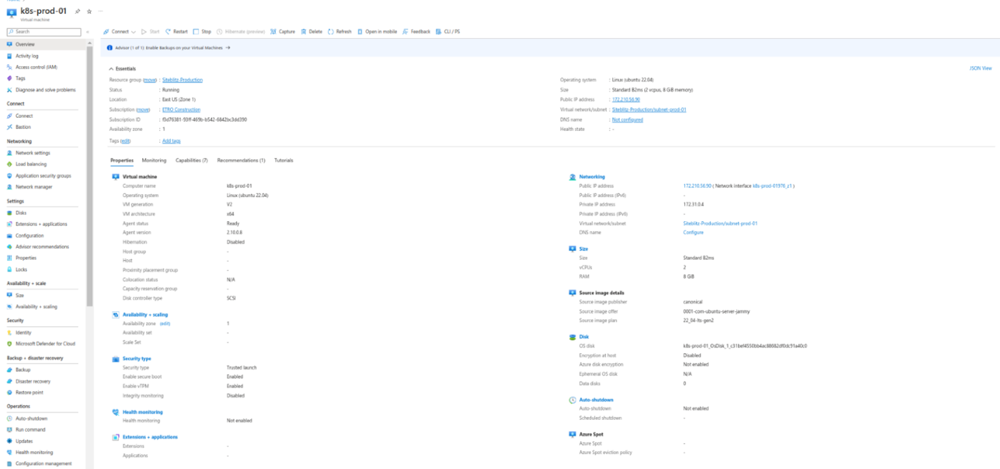
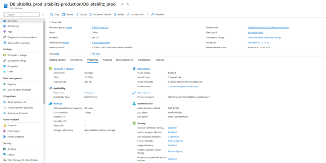
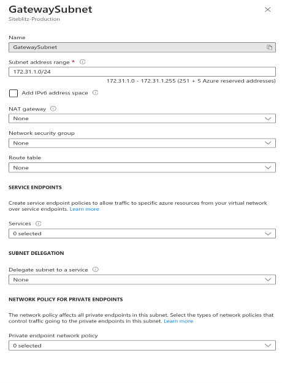

1. Infraestrutura

Este é um documento as-built para a infraestrutura de nuvem do Azure que foi criada para o cliente ETRO CONSTRUCTION. Esta infraestrutura foi criada para o aplicativo Siteblitz.

1. Armazenamento de objetos

O armazenamento de objetos foi criado para fornecer uma solução de armazenamento escalável e econômica para dados não estruturados, como imagens, vídeos e logs. Ele foi configurado para dimensionar e manipular automaticamente grandes quantidades de dados.

2. Backend do Siteblitz

O backend do Siteblitz foi criado usando o Azure Kubernetes Service (AKS) e o k3s. Ele foi configurado para dimensionar e manipular automaticamente alto tráfego. Ele também foi configurado para usar um registro de contêiner para armazenar e gerenciar imagens de contêiner.

3. Máquinas virtuais

As máquinas virtuais foram criadas para hospedar o aplicativo Siteblitz e outros serviços. Elas foram configuradas para usar os discos gerenciados do Azure para armazenamento e foram colocadas em um conjunto de disponibilidade para garantir alta disponibilidade.

4. Dados

O armazenamento de dados foi configurado usando bancos de dados SQL do Azure. Os bancos de dados foram configurados para dimensionar e manipular automaticamente alto tráfego. Eles também foram configurados para usar o serviço de backup gerenciado do Azure para proteção de dados.

6. Kubernetes (k3s)

O Kubernetes foi usado para gerenciar e orquestrar o aplicativo Siteblitz e outros serviços. Ele foi configurado para usar o serviço Kubernetes gerenciado do Azure (AKS) para dimensionamento automático e alta disponibilidade.

6. Pods

Os pods foram criados para executar o aplicativo Siteblitz e outros serviços. Eles foram configurados para usar o serviço Kubernetes gerenciado do Azure (AKS) para dimensionamento automático e alta disponibilidade.

7. Serviço

Os serviços foram criados para expor o aplicativo Siteblitz e outros serviços à Internet. Eles foram configurados para usar o serviço Kubernetes gerenciado do Azure (AKS) para dimensionamento automático e alta disponibilidade.

8. Ingress

O Ingress foi criado para rotear o tráfego para o aplicativo Siteblitz e outros serviços. Ele foi configurado para usar o serviço Kubernetes gerenciado do Azure (AKS) para dimensionamento automático e alta disponibilidade.

9. Rede

Uma rede virtual foi criada para isolar o aplicativo Siteblitz e outros serviços da Internet. Ela foi configurada para usar o serviço de rede virtual gerenciada do Azure para dimensionamento automático e alta disponibilidade.

10. Zona DNS

Uma zona DNS foi criada para fornecer um nome de domínio personalizado para o aplicativo Siteblitz. Ela foi configurada para usar o serviço DNS gerenciado do Azure para dimensionamento automático e alta disponibilidade.

11. Gateway de rede virtual

Um gateway de rede virtual foi criado para fornecer conectividade segura entre o aplicativo Siteblitz e outros serviços. Ele foi configurado para usar o serviço de gateway de rede virtual gerenciada do Azure para dimensionamento automático e alta disponibilidade.

12. Gateway de rede local

Um gateway de rede local foi criado para fornecer conectividade segura entre o aplicativo Siteblitz e outros serviços. Ele foi configurado para usar o serviço de gateway de rede local gerenciada do Azure para dimensionamento automático e alta disponibilidade.

13. Balanceamento de carga (gateway de aplicativo)

Um gateway de aplicativo foi criado para fornecer balanceamento de carga e roteamento de tráfego para o aplicativo Siteblitz e outros serviços. Ele foi configurado para usar o serviço de gateway de aplicativo gerenciado do Azure para dimensionamento automático e alta disponibilidade.

14. Segurança

A segurança foi configurada usando o centro de segurança do Azure para fornecer proteção contra ameaças, avaliação de vulnerabilidades e aplicação de políticas de segurança. Ele também foi configurado para usar o serviço de firewall gerenciado do Azure para filtragem de tráfego e controle de acesso.

15. WAF

Um firewall de aplicativo da Web (WAF) foi criado para fornecer proteção contra ataques de aplicativo da Web. Ele foi configurado para usar o serviço WAF gerenciado do Azure para dimensionamento automático e alta disponibilidade.

16. Registro de contêiner

Um registro de contêiner foi criado para armazenar e gerenciar imagens de contêiner para o aplicativo Siteblitz e outros serviços. Ele foi configurado para usar o serviço de registro de contêiner gerenciado do Azure para dimensionamento automático e alta disponibilidade.

17. Gateway VPN

Um gateway VPN foi criado para fornecer conectividade segura entre o aplicativo Siteblitz e outros serviços. Ele foi configurado para usar o serviço de gateway VPN gerenciado do Azure para dimensionamento automático e alta disponibilidade.

18. VPN Site-to-site (IPsec)

Uma VPN site-to-site foi criada para fornecer conectividade segura entre o aplicativo Siteblitz e outros serviços. Ela foi configurada para usar o serviço VPN site-to-site gerenciado do Azure para dimensionamento automático e alta disponibilidade.

19. VPN Site-to-site (IPsec) ETRO CONSTRUCTION com METATRON

Uma VPN site-to-site foi criada para fornecer conectividade segura entre o aplicativo Siteblitz e outros serviços. Ela foi configurada para usar o serviço VPN site-to-site gerenciado do Azure para dimensionamento automático e alta disponibilidade.

20. VPN Site-to-site (IPsec) ETRO CONSTRUCTION com AUDAZ TECNOLOGIA

Uma VPN site-to-site foi criada para fornecer conectividade segura entre o aplicativo Siteblitz e outros serviços. Ela foi configurada para usar a VPN site-to-site gerenciada do Azure